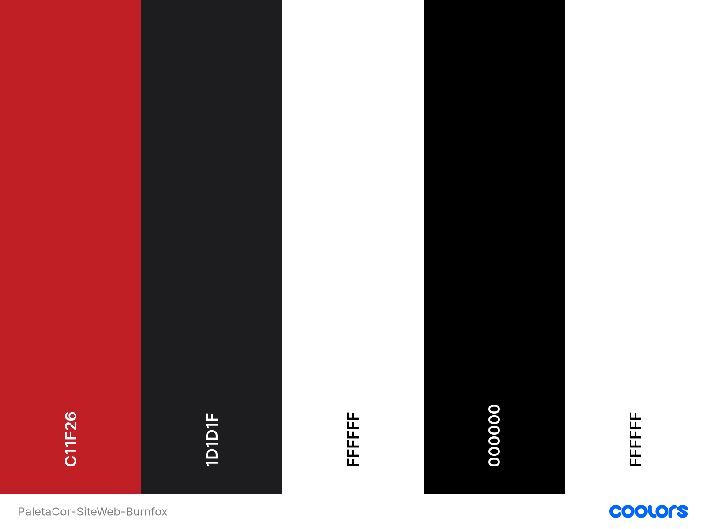
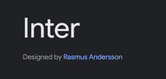
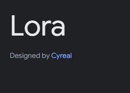

# Projeto-WEB---Kicks
Projeto de um site web criado do 0, onde o tema escolhido foi Esporte e o site criado foi de um box/academia de crossfit.

Esboço inicial no figma:
https://www.figma.com/file/0WlHQxkcKfJ44IkSYXUQ2e/Projeto-WEB-Kick?type=design&node-id=0%3A1&mode=design&t=P36Mrdn7Tp2Q7CL3-1
[text](<Figma/Projeto WEB Kick - BurnFox.fig>)
[text](<Figma/Projeto WEB Kick - BurnFox.pdf>)

Paleta de cores utilizada:

Fontes utilizadas:
 

